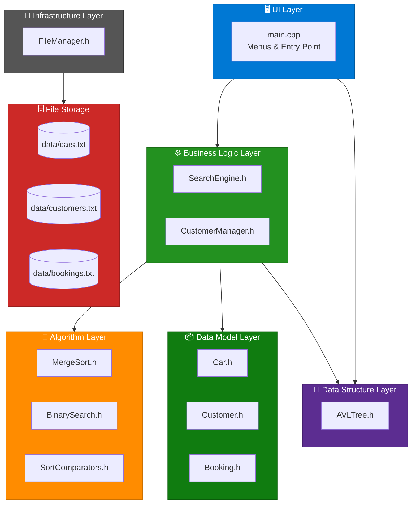
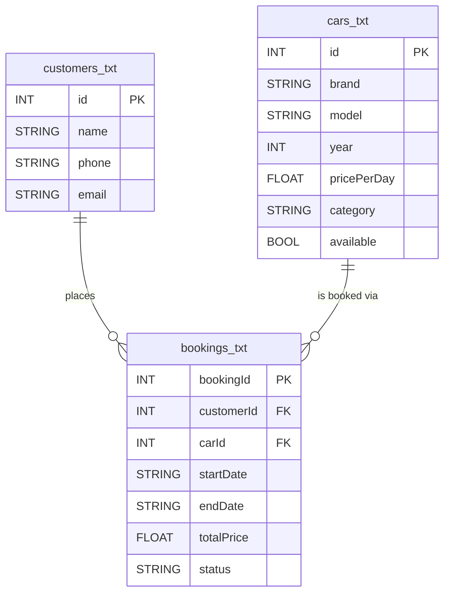
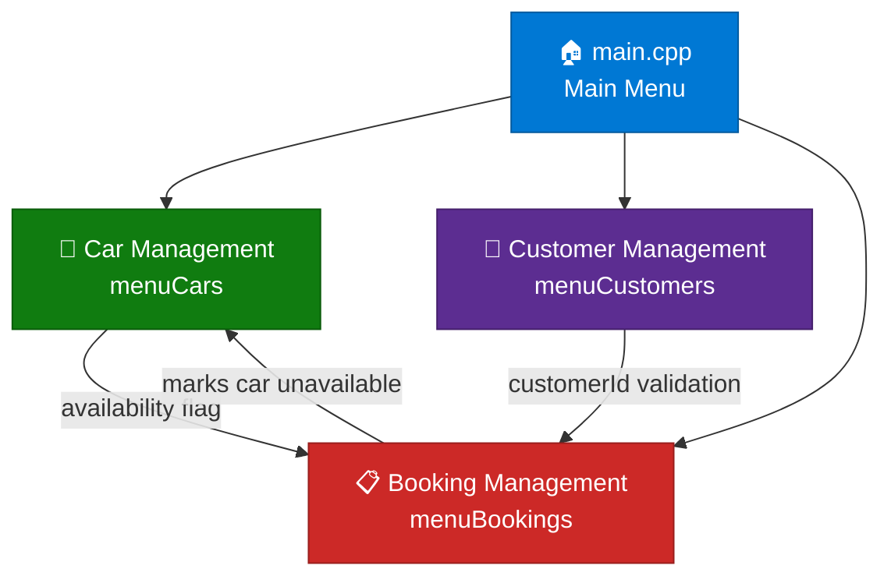

<div align="center">

# 🚗 Vehicle Rental System

[](https://isocpp.org/)
[]()
[]()
[]()
[](https://visualstudio.microsoft.com/)

**A fully algorithmic C++ console application for managing a vehicle rental business — customers, fleet, bookings, and more.**

[Overview](#-project-overview) • [Architecture](#-architecture) • [Data Storage](#-data-storage-schema) • [Modules](#-application-modules) • [Algorithms](#-algorithms--data-structures) • [Setup](#-installation--setup)

</div>

---

## 🚀 Project Overview

The **Vehicle Rental System** is a console application built entirely in **C++17** with no external dependencies. It provides a complete workflow for managing a vehicle rental business — from registering customers and a car fleet through to creating bookings and tracking cancellations.

The application was developed as part of a **Design & Analysis of Algorithms** course project. Every core operation is backed by a rigorously selected algorithm or data structure: the car fleet is stored in an **AVL Tree** for O(log n) lookup, all sorting operations use **Merge Sort** for O(n log n) guaranteed performance, and all indexed lookups use **Binary Search** for O(log n) access.

Data is persisted to plain pipe-delimited text files (`customers.txt`, `cars.txt`, `bookings.txt`) and reloaded on every startup — no database engine required.

---

## 📊 Architecture

### Application Layers



### Project Structure

| Layer | Files | Responsibility |
|---|---|---|
| **UI Layer** | `main.cpp` | All console menus, input handling, and program entry point |
| **Business Logic** | `SearchEngine.h`, `CustomerManager.h` | All CRUD operations, search, sort, and filter logic |
| **Algorithm Layer** | `MergeSort.h`, `BinarySearch.h`, `SortComparators.h` | Generic, reusable algorithm implementations |
| **Data Structure** | `AVLTree.h` | Self-balancing BST for O(log n) car storage and retrieval |
| **Data Models** | `Car.h`, `Customer.h`, `Booking.h` | Plain entity structs |
| **Infrastructure** | `FileManager.h` | All file I/O — load and save for every entity |

### Technology Stack

| Technology | Version | Role |
|---|---|---|
| **C++** | C++17 | Core application language |
| **STL** | Standard Library | `vector`, `string`, `fstream`, `functional` |
| **File Storage** | Plain text (pipe-delimited) | Persistent data storage — no DB required |
| **Visual Studio** | 2022 | IDE and build tooling |

---

## 🗄️ Data Storage Schema

All data is stored in the `data/` folder as pipe-delimited (`|`) text files. The `FileManager` handles all reading and writing, with `stripCR()` applied to every token for cross-platform safety.

### Files Overview



### customers.txt

| Field | Type | Description |
|---|---|---|
| `id` | INT | Unique customer ID (auto-incremented from max existing) |
| `name` | STRING | Full name — letters and spaces only |
| `phone` | STRING | 10–15 digit phone number (`+`, `-` allowed) |
| `email` | STRING | Valid email address (`@` and `.` required) |

**Example row:** `501|Ziad Ahmed|+20123456789|ziad@example.com`

### cars.txt

| Field | Type | Description |
|---|---|---|
| `id` | INT | Unique car ID — also used as the AVL Tree key |
| `brand` | STRING | Manufacturer brand (e.g. Toyota, BMW) |
| `model` | STRING | Model name (e.g. Camry, X5) |
| `year` | INT | Model year |
| `pricePerDay` | FLOAT | Daily rental rate in USD |
| `category` | STRING | Type label (Sedan, SUV, Electric, Hatchback, Sports, Truck) |
| `available` | BOOL | `1` = available; `0` = currently rented |

**Example row:** `101|Toyota|Camry|2023|45.5|Sedan|1`

### bookings.txt

| Field | Type | Description |
|---|---|---|
| `bookingId` | INT | Unique booking ID (auto-incremented from max existing) |
| `customerId` | INT | FK → customer in customers.txt |
| `carId` | INT | FK → car in cars.txt |
| `startDate` | STRING | Rental start date in `YYYY-MM-DD` format |
| `endDate` | STRING | Rental end date in `YYYY-MM-DD` format |
| `totalPrice` | FLOAT | `pricePerDay × days` calculated at booking time |
| `status` | STRING | `Active`, `Completed`, or `Cancelled` |

**Example row:** `9001|501|101|2026-05-20|2026-05-25|227.5|Cancelled`

---

## 📦 Application Modules

### Module Navigation Flow



### 🏠 Main Menu — `main.cpp`

The entry point of the application. On startup it calls `FileManager::loadCars()`, `FileManager::loadBookings()`, and the `CustomerManager` constructor (which loads customers internally). The main loop routes to one of three sub-menus and saves all data to disk on exit.

### 🚗 Car Management — `menuCars()`

Full CRUD management of the vehicle fleet, backed by the AVL Tree for all storage and retrieval.

| Option | Action | Algorithm |
|---|---|---|
| **1. View all cars** | Lists every car sorted by ID | AVL in-order traversal |
| **2. Sort by price** | Cheapest first | Merge Sort on `pricePerDay` |
| **3. Sort by year** | Newest first | Merge Sort on `year` (descending) |
| **4. Search by ID** | Find a single car | AVL tree search O(log n) |
| **5. Search by category** | All cars in a category | Merge Sort + Binary Search (expand) |
| **6. Search by price range** | All cars within min–max | Merge Sort + Binary Range Search |
| **7. Available cars only** | Filter to rentable cars | Linear scan O(n) |
| **8. Add car** | Insert into AVL Tree + save | AVL insert O(log n) |
| **9. Remove car** | Delete from AVL Tree + save | AVL remove O(log n) |

### 👤 Customer Management — `menuCustomers()` + `CustomerManager`

Full CRUD management of the customer register. `CustomerManager` keeps its internal vector **always sorted by ID** (via Merge Sort after every insert) so Binary Search is valid at all times. The `CustomerManager` constructor loads customers from file automatically.

| Field | Validation Rule |
|---|---|
| Name | Non-empty, no digit characters |
| Phone | 10–15 characters, digits / `+` / `-` only |
| Email | Must contain both `@` and `.` |

| Option | Action | Algorithm |
|---|---|---|
| **1. View all** | Lists every customer | Sequential read |
| **2. Search by ID** | Find one customer | Binary Search O(log n) |
| **3. Search by name** | Partial, case-insensitive | Linear scan O(n) |
| **4. Customer profile** | Full details + booking history | Linear scan on bookings |
| **5. Add** | Validates + inserts, re-sorts | Merge Sort to restore invariant |
| **6. Update** | Validates changed fields, saves | Direct pointer update |
| **7. Remove** | Erase from vector, saves | Linear find + erase |

### 📋 Booking Management — `menuBookings()`

Records and manages rental transactions. Creating a booking validates that both the customer and car exist, checks car availability, calculates the total price, and immediately marks the car as unavailable. Cancelling a booking restores availability.

| Option | Action | Algorithm |
|---|---|---|
| **1. View by date** | All bookings, earliest first | Merge Sort on `startDate` |
| **2. View by price** | All bookings, cheapest first | Merge Sort on `totalPrice` |
| **3. Search by ID** | Find one booking | Merge Sort + Binary Search O(log n) |
| **4. Create booking** | Validates + inserts, saves all | AVL lookup + vector push |
| **5. Cancel booking** | Sets `Cancelled`, frees car, saves | Linear find + AVL update |

> **Date arithmetic:** `daysBetween()` uses the approximation `y×365 + m×30 + d` — sufficient for pricing calculations in a rental context.

---

## 🧮 Algorithms & Data Structures

### AVL Tree — `AVLTree.h`

The entire car fleet is stored in a self-balancing AVL Tree keyed on `Car::id`. This guarantees O(log n) insert, delete, and search regardless of insertion order — a plain BST would degrade to O(n) with sorted input.

```
Balance Factor = height(left) - height(right)

Four rebalancing cases handled:
  • Left-Left   → Single right rotation
  • Right-Right → Single left rotation
  • Left-Right  → Left rotation on child, then right rotation
  • Right-Left  → Right rotation on child, then left rotation
```

| Operation | Time Complexity |
|---|---|
| `insert(car)` | O(log n) |
| `remove(id)` | O(log n) |
| `search(id)` | O(log n) |
| `inOrder()` | O(n) |

### Merge Sort — `MergeSort.h`

All sorting operations use a **generic templated Merge Sort** that accepts any comparator via `std::function`. This provides O(n log n) guaranteed performance in all cases — unlike Quick Sort which degrades to O(n²) on already-sorted input (a realistic scenario when re-sorting data loaded from file).

```cpp
// Generic overload — works on any type T with any comparator
template <typename T>
void mergeSort(std::vector<T>& arr,
               const std::function<bool(const T&, const T&)>& cmp);
```

**Used for:** sorting cars by price, year, or category; sorting bookings by date or price; sorting customers by ID; sorting before every Binary Search.

### Binary Search — `BinarySearch.h`

All ID-based and key-based lookups use a generic Binary Search that operates on any sorted vector with any key extractor. Three variants are provided:

| Function | Returns | Use case |
|---|---|---|
| `binarySearchIndex()` | Index or `-1` | Single exact match |
| `binarySearch()` | Pointer or `nullptr` | Direct element access |
| `binarySearchAll()` | `vector<T>` | All matches (non-unique keys, e.g. category) |
| `binarySearchRange()` | `vector<T>` | Range query (e.g. price between min and max) |

**Precondition:** the vector must be sorted by the same key being searched — enforced by always calling `mergeSort()` immediately before any `binarySearch*()` call.

### Sort Comparators — `SortComparators.h`

All comparator functions are defined as plain `inline bool` functions, making them zero-overhead and compatible with `std::function` wrapping.

| Comparator | Sorts by |
|---|---|
| `cmpCarByPrice` | `pricePerDay` ascending |
| `cmpCarByPriceDesc` | `pricePerDay` descending |
| `cmpCarByYear` | `year` descending (newest first) |
| `cmpCarByCategory` | `category` alphabetically |
| `cmpCarById` | `id` ascending |
| `cmpBookingByDate` | `startDate` lexicographic (works for YYYY-MM-DD) |
| `cmpBookingByPrice` | `totalPrice` ascending |
| `cmpBookingById` | `bookingId` ascending |
| `cmpCustomerByName` | `name` alphabetically |
| `cmpCustomerById` | `id` ascending |

---

## ✨ Features

**🌳 AVL Tree Fleet Store:** The car fleet lives in a self-balancing AVL Tree — O(log n) insert, delete, and search guaranteed, with in-order traversal always returning cars sorted by ID.

**🔄 Full CRUD Operations:** Add, update, delete, and view records for cars, customers, and bookings, with every write persisted immediately to file.

**📊 Merge Sort Everywhere:** All sorting — cars by price or year, bookings by date or price, customers by ID — uses the same generic templated Merge Sort for O(n log n) guaranteed performance.

**🔍 Binary Search Lookups:** Lookups by ID and key use Binary Search (O(log n)) across all entities. Range queries (e.g. price between $30 and $70) use a dedicated binary range search variant.

**🔗 Automatic Availability Management:** Creating a booking marks the car unavailable; cancelling it restores availability — no manual steps, no stale data.

**✅ Input Validation:** `CustomerManager` enforces name, phone, and email rules before any write. Booking creation validates both the customer ID and car ID exist and checks availability before committing.

**💾 File-Based Persistence:** All data survives between runs via pipe-delimited text files. `FileManager` handles all I/O with `stripCR()` on every token for Windows/Unix compatibility.

**🧩 Generic Algorithms:** `MergeSort` and `BinarySearch` are fully templated — they work on `vector<Car>`, `vector<Customer>`, and `vector<Booking>` with the same code, no duplication.

---

## ⚡ Design Decisions

### AVL Tree over Hash Table or Plain BST
A Hash Table would give O(1) average lookup but O(n) worst case and no ordered traversal. A plain BST degrades to O(n) on sorted input. The AVL Tree gives O(log n) guaranteed for all operations and natural in-order output (cars listed by ID without a separate sort), which matches the application's primary display mode.

### Merge Sort over Quick Sort
Car and booking data loaded from file is often nearly sorted. Quick Sort degrades to O(n²) on already-sorted input with a naive pivot — Merge Sort guarantees O(n log n) regardless of input order. This consistency is more important than Quick Sort's better cache behaviour on random data.

### Binary Search Precondition Pattern
Rather than maintaining separate pre-sorted indexes, every `binarySearch*()` call is preceded by a `mergeSort()` call. This is explicit and safe: the sort is always applied to the exact key being searched, eliminating the risk of searching a stale or differently-sorted vector.

### CustomerManager Sort Invariant
`CustomerManager` re-sorts its vector by ID after every `addCustomer()` call. This keeps the Binary Search precondition satisfied at all times without needing a flag or lazy-sort mechanism — simpler, and the cost of sorting a small customer list is negligible.

### Static FileManager
`FileManager` is entirely static with no instantiation. This avoids passing a file manager object through every layer and mirrors the singleton behaviour of a database connection factory, while keeping the code simple for a console application.

---

## 🗂️ File Reference

| File | Type | Purpose |
|---|---|---|
| `main.cpp` | Entry Point + UI | Main menu, all sub-menus, `printCar`, `printBooking`, `daysBetween` helpers |
| `CustomerManager.h` | Logic | Customer CRUD, validation, Binary Search lookups, profile display |
| `SearchEngine.h` | Logic | All car and booking search/sort operations — delegates to AVL, MergeSort, BinarySearch |
| `AVLTree.h` | Data Structure | Self-balancing BST — insert, remove, search, in-order traversal |
| `MergeSort.h` | Algorithm | Generic templated Merge Sort — full vector and range overloads |
| `BinarySearch.h` | Algorithm | Generic Binary Search — index, pointer, all-matches, and range variants |
| `SortComparators.h` | Utilities | All inline comparator functions for Merge Sort |
| `FileManager.h` | Infrastructure | Load/save for cars (AVL), customers (vector), bookings (vector) |
| `Car.h` | Model | `Car` struct: id, brand, model, year, pricePerDay, category, available |
| `Customer.h` | Model | `Customer` struct: id, name, phone, email |
| `Booking.h` | Model | `Booking` struct: bookingId, customerId, carId, startDate, endDate, totalPrice, status |
| `data/cars.txt` | Storage | Pipe-delimited car records |
| `data/customers.txt` | Storage | Pipe-delimited customer records |
| `data/bookings.txt` | Storage | Pipe-delimited booking records |

---

## 🛠️ Installation & Setup

### Prerequisites

- Visual Studio 2022 (or any C++17-capable compiler, e.g. GCC 9+, Clang 10+)
- C++17 standard library support
- No external libraries required

### 1. Clone the Repository

```bash
git clone https://github.com/your-username/VehicleRentalSystem-CPP.git
cd VehicleRentalSystem-CPP
```

### 2. Build with Visual Studio

```
1. Open VehicleRental.sln in Visual Studio 2022
2. Build → Build Solution  (Ctrl+Shift+B)
3. Debug → Start Debugging  (F5)
```

### 3. Build with g++ (Linux / macOS / WSL)

```bash
cd VehicleRental
g++ -std=c++17 -O2 -o VehicleRental main.cpp
./VehicleRental
```

### 4. Data Files

The application expects a `data/` folder in the **same directory as the executable** containing the three data files:

```
data/
├── cars.txt
├── customers.txt
└── bookings.txt
```

If any file is missing, `FileManager::ensureExists()` creates an empty one automatically — the system starts with an empty dataset and you can add records from the menus.

> **Visual Studio note:** the working directory defaults to the project folder (`VehicleRental/VehicleRental/`), which is where the `data/` folder lives. If you move the compiled binary, copy the `data/` folder alongside it.

---

## 🔧 Troubleshooting

<details>
<summary><strong>🔴 "Cannot open data/cars.txt" on startup</strong></summary>

**Symptoms**: Parse error messages appear immediately when the app launches, or the car list is empty.

**Likely causes:**
- The executable is being run from a different working directory than expected
- The `data/` folder does not exist next to the executable

**Solution:**
```
1. In Visual Studio: Project Properties → Debugging → Working Directory
   Set it to: $(ProjectDir)  (this is the default and should already be correct)
2. If running the compiled binary directly, ensure the data/ folder is in the same
   directory as the VehicleRental executable
3. The system will auto-create empty data files if they are missing — just start fresh
```
</details>

<details>
<summary><strong>🟡 Car still shows as unavailable after cancelling a booking</strong></summary>

**Symptoms**: A car remains marked as `(Rented)` in the Car Management menu after its booking was cancelled.

**Solution**: This is a display refresh issue. Exit back to the Main Menu and re-enter Car Management — availability is updated in the AVL Tree and saved to file immediately on cancellation, and the menu re-reads from the tree on every view.
</details>

<details>
<summary><strong>🔴 Compilation error: "no matching function for call to mergeSort"</strong></summary>

**Symptoms**: Build fails with a template deduction error on `mergeSort` calls.

**Solution**: Ensure the comparator is wrapped in `std::function<bool(const T&, const T&)>`. The template requires an explicit `std::function` — a raw lambda or function pointer alone will not deduce correctly:

```cpp
// ✅ Correct
std::function<bool(const Car&, const Car&)> cmp = cmpCarByPrice;
mergeSort(cars, cmp);

// ❌ Will not compile
mergeSort(cars, cmpCarByPrice);
```
</details>

<details>
<summary><strong>🟡 Binary Search returns -1 for a value that exists</strong></summary>

**Symptoms**: A search by ID or category returns "not found" even though the record is in the data files.

**Likely cause**: The vector was not sorted by the same key before calling `binarySearchIndex`. The function's precondition is that the vector is sorted.

**Solution**: Always call `mergeSort()` with the matching comparator immediately before any `binarySearch*()` call — this is the pattern used throughout `SearchEngine.h` and `CustomerManager.h`.
</details>

---

## 👥 Project Team

| Member Name |
|---|
| Ziad Ahmed Elbahy |
| Abdelrahman Sapry Abdelaziz |
| Zyad Akram Mahgoub |
| Seif Eldeen Mohamed |
| Mohamed Ehab |
| Mohamed Ahmed Said |
